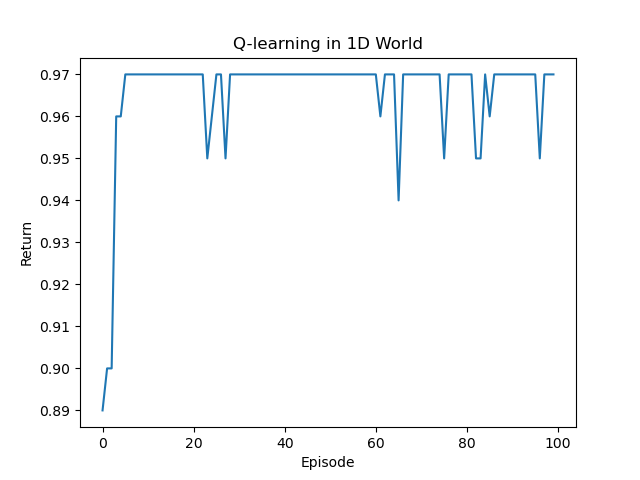
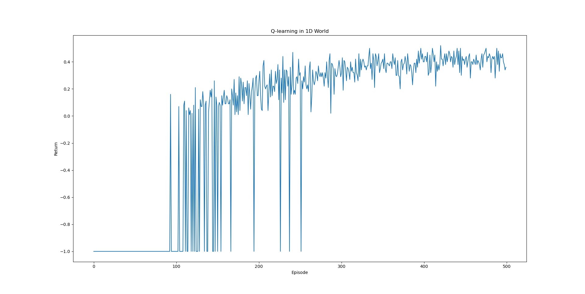
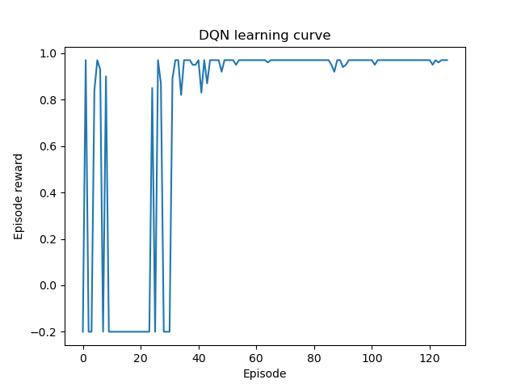
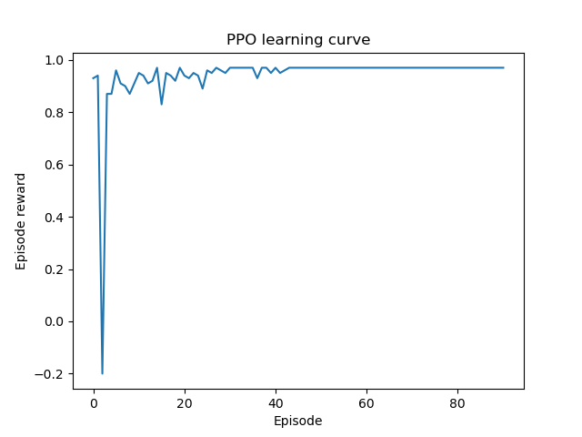

Simple one-dimension reinforcement learning
===========================================

Super-simple Gymnasium: line of cells, agent walks from left to right.

Reward is 1 for reaching the rightmost position. Reward for not reaching is -0.01

Q-table
-------

The Q-table is a matrix containing the expected future reward for each action in each state.

Learning curve for 50 cells with maximum 100 steps:

DQN learning
------------

DQN = Deep Q-Network

If the number of states is high, the Q-table grows too big. DQN learning replaces the Q-table with a neural network. 

PPO learning
------------

PPO = Proximal Policy Optimization

Uses two neural networks, one for computing the probabilities of each action in a state and one for computing the value of a state. 

Proximal = keep the new policy in the proximity of the old one (clip the policy step to keep learning stable)

